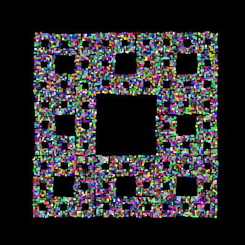

# Sierpinski's Carpet OpenGL Visualization

This project is created to write an implementation of Sierpinki's carpet in C++ using OpenGL.



## Dependencies

To use the project you should install the following packages :

*`CMake`
*`OpenGL`
*`GLUT`

## Usage

In this section you can read about how to build and use this project.

### Building process

To build the project execute the following commands :

```bash
mkdir -p build && cd build
cmake ..
make
```

## Running the app

To run the app just execute the following command :

``` bash
./carpet
```
